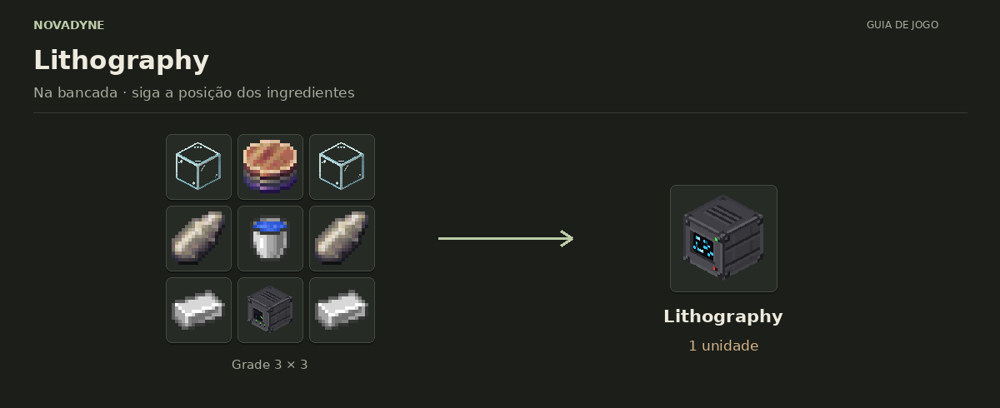

# NovaDyne

## [📖 Abrir a wiki visual](wiki/README.md)

Receitas em grade 3×3, entradas e saídas das máquinas, materiais, valves e progressão.

[](wiki/README.md)

Mod de máquinas de progressão eletrônica para Minecraft NeoForge 26.1.2.

## Conteúdo

- **Máquinas:** Macerator, Wafer Press, Processor e Litografia — blocos com
  GUI, inventário e armazenamento de energia.
- **Materiais:** Pure Silicon, wafers de silício, Ceramic Powder, Copper
  Layer, Base Wafer e Stacked Electronic Circuit.
- **Upgrades:** Válvulas de tier 1 a 7, usadas para reduzir a chance de falha
  da Litografia.
- **Teste em criativo:** Test Power Hub alimenta máquinas NovaDyne numa área
  horizontal 5 × 5; não possui receita de survival.
- **Planejado** — Plasma Cannon (arma de energia), veículos e armas. Nada
  disso é anunciado como disponível.

## Development

Built with NeoForge MDK. Java 25 required.

```bash
./gradlew build
```

## Testar sem abrir o Minecraft no seu computador

1. Abra **Actions → Build** neste repositório e selecione a execução mais recente da branch `main`.
2. Confirme que **Build with Gradle** e **Test machines on Minecraft server** estão verdes. Os testes iniciam um servidor no GitHub e conferem registro dos itens, energia, bloqueio de saída e o processamento das quatro máquinas.
3. Em **Artifacts**, baixe `novadyne-jar`, descompacte o ZIP e use o arquivo `.jar` em uma instalação limpa de **Minecraft 26.1.2 / NeoForge 26.1.2.76**.

Para verificar a aparência e as GUIs, ainda é preciso abrir o cliente Minecraft. Em um PC com 4 GB de RAM, feche outros programas, use gráficos Fast e ajuste a memória máxima do launcher para 1536 MB ou 2 GB. Crie um mundo novo em criativo, coloque o Test Power Hub no chão e as quatro máquinas no mesmo nível, até dois blocos de distância em cada direção horizontal. Ele fornece até 1.000 FE/t por máquina e permite testar os processos pela GUI. Não tem receita de survival.
