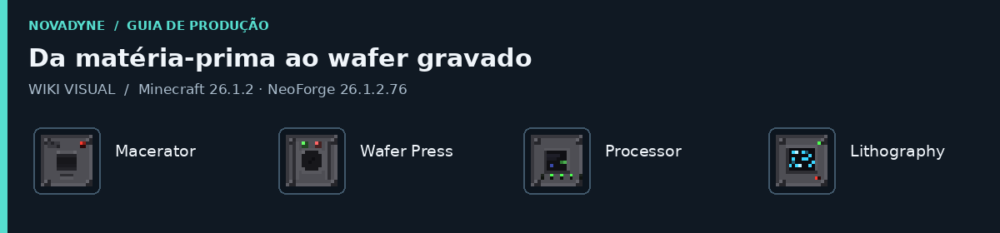
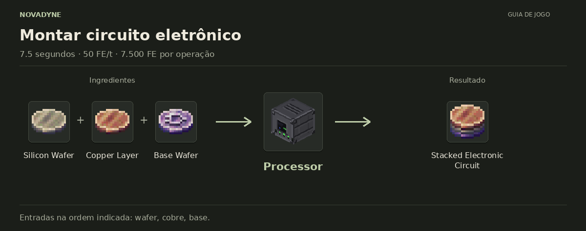

<h1 align="center">NovaDyne</h1>
<p align="center">Da argila, do quartzo e do cobre até um wafer gravado.</p>
<p align="center">
  <a href="wiki/README.md">Wiki visual</a> ·
  <a href="wiki/receitas.md">Receitas</a> ·
  <a href="wiki/progressao.md">Progressão</a> ·
  <a href="https://github.com/nicotfpn/Novadyne-MOD/actions/workflows/build.yml">Baixar o JAR</a>
</p>

O NovaDyne é um mod de progressão eletrônica para **Minecraft Java 26.1.2 com NeoForge**. Comece moendo argila, prepare as camadas do circuito e passe pela litografia até chegar ao wafer final. As máquinas têm inventário e interface próprios, consomem energia FE e podem ser construídas em survival.

## A linha de produção

| Macerator | Wafer Press | Processor | Lithography |
| :---: | :---: | :---: | :---: |
| [](wiki/itens/macerator.md) | [](wiki/itens/wafer_press.md) | [](wiki/itens/processor.md) | [](wiki/itens/litografia.md) |
| Moe argila e recicla wafers com falha | Prensa cerâmica, cobre e silício | Monta o circuito eletrônico | Grava e limpa o wafer |

Argila vira **Ceramic Powder**; quartzo fundido vira **Pure Silicon**. A prensa prepara Base Wafer, Copper Layer e Silicon Wafer. O Processor junta as três peças, e a Lithography grava o circuito. A gravação pode falhar: as **valves** melhoram a chance de sucesso, e wafers com falha podem ser reciclados.

[](wiki/itens/processor.md)

Cada etapa, com ingredientes e saídas ilustrados, está na [wiki visual](wiki/README.md). O **Etched Silicon Wafer** é o fim da cadeia disponível atualmente.

## Instalar e jogar

1. Instale **Minecraft Java 26.1.2**, **NeoForge 26.1.2.76** e use **Java 25**.
2. Abra o [workflow Build](https://github.com/nicotfpn/Novadyne-MOD/actions/workflows/build.yml), escolha uma execução verde da branch `main` e baixe o artifact **`novadyne-jar`**. É preciso entrar no GitHub para baixar artifacts.
3. Extraia o ZIP e coloque o arquivo `.jar` na pasta `mods` da instalação NeoForge.

As máquinas recebem **energia FE externa**. Para montar a linha em survival, use uma fonte de FE de outro mod. O NovaDyne ainda não tem geração de energia na progressão.

Quer experimentar as máquinas primeiro? Pegue o [Test Power Hub](wiki/itens/test_power_hub.md) no criativo ou com `/give @s novadyne:test_power_hub`. Coloque as máquinas no mesmo nível, até dois blocos para cada lado: ele alimenta cada uma dentro do quadrado 5 × 5. O bloco é exclusivo para testes e não tem receita de craft. Há um [guia rápido de instalação e testes](wiki/testar.md).

## Desenvolvimento

O projeto usa **NeoForge 26.1.2.76**, **Java 25** e o Gradle Wrapper. Para compilar e rodar os testes em um servidor Minecraft:

```bash
./gradlew build
./gradlew runGameTestServer
```

Os mesmos passos rodam no [GitHub Actions](https://github.com/nicotfpn/Novadyne-MOD/actions/workflows/build.yml), que também disponibiliza o JAR compilado. As receitas e páginas dos itens são mantidas na [wiki](wiki/README.md); instruções para atualizá-la ficam em [manutenção](wiki/manutencao.md).

O mod está em desenvolvimento. A [lista de materiais](wiki/materiais.md), as [receitas](wiki/receitas.md) e as [máquinas](wiki/maquinas.md) documentam o conteúdo jogável desta versão.
