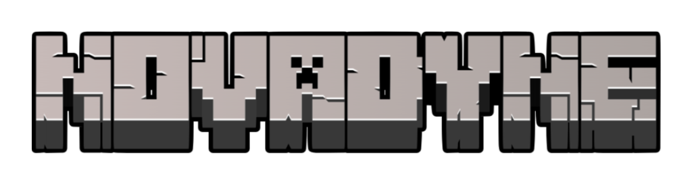

<div align="center">
  
  <p><strong>Da argila ao circuito. Uma fábrica inteira, bloco por bloco.</strong></p>
  <p>
    <a href="https://github.com/nicotfpn/Novadyne-MOD/wiki">Explorar a Wiki</a> ·
    <a href="https://github.com/nicotfpn/Novadyne-MOD/wiki/progressao">Começar no survival</a> ·
    <a href="https://github.com/nicotfpn/Novadyne-MOD/actions/workflows/build.yml">Baixar o mod</a>
  </p>
  <p><code>Minecraft Java 26.1.2</code> &nbsp; <code>NeoForge 26.1.2.76</code> &nbsp; <code>Java 25</code></p>
</div>

---

**NovaDyne** é um mod de eletrônica industrial para Minecraft. Extraia materiais, construa máquinas, gere energia e processe silício até chegar a um wafer gravado. A linha de produção pode ser montada no survival.

## Monte sua linha

| 01 · Macerator | 02 · Wafer Press | 03 · Processor | 04 · Lithography |
| :---: | :---: | :---: | :---: |
| [](https://github.com/nicotfpn/Novadyne-MOD/wiki/macerator) | [](https://github.com/nicotfpn/Novadyne-MOD/wiki/wafer_press) | [](https://github.com/nicotfpn/Novadyne-MOD/wiki/processor) | [](https://github.com/nicotfpn/Novadyne-MOD/wiki/litografia) |
| Triture argila e recicle wafers | Prense cerâmica, cobre e silício | Monte o circuito eletrônico | Grave e limpe o wafer |


O caminho começa com **Ceramic Powder**, **Pure Silicon** e **Copper Layer**. A prensa prepara os wafers; o Processor reúne as peças; a Lithography grava o circuito. Se a gravação falhar, você pode reciclar o wafer. **Valves** melhoram a chance de sucesso.

## Ligue a fábrica

- **Energia:** Fuel Generator e geradores solares alimentam máquinas diretamente ou por [Energy Cables](https://github.com/nicotfpn/Novadyne-MOD/wiki/energy_cable). O solar avançado continua gerando 25% durante a noite.
- **Água:** [Water Sink](https://github.com/nicotfpn/Novadyne-MOD/wiki/water_sink) → [Fluid Pipes](https://github.com/nicotfpn/Novadyne-MOD/wiki/fluid_pipe) → Lithography. A limpeza de cada wafer consome 1.000 mB.
- **Para testes:** o [Test Power Hub](https://github.com/nicotfpn/Novadyne-MOD/wiki/test_power_hub) alimenta máquinas próximas e está disponível no criativo, sem receita de craft.

## Instalação

1. Prepare **Minecraft Java 26.1.2**, **NeoForge 26.1.2.76** e **Java 25**.
2. Na página do [Build](https://github.com/nicotfpn/Novadyne-MOD/actions/workflows/build.yml), abra uma execução verde da branch `main` e baixe o artifact **`novadyne-jar`**. O GitHub pede login para baixar artifacts.
3. Extraia o ZIP e coloque o `.jar` na pasta `mods` da instalação NeoForge.

Primeira vez? A [Wiki do GitHub](https://github.com/nicotfpn/Novadyne-MOD/wiki) reúne a [progressão](https://github.com/nicotfpn/Novadyne-MOD/wiki/progressao), as [receitas ilustradas](https://github.com/nicotfpn/Novadyne-MOD/wiki/receitas) e um [guia para testar no jogo](https://github.com/nicotfpn/Novadyne-MOD/wiki/testar).

## Desenvolvimento

```bash
./gradlew build
./gradlew runGameTestServer
```

O projeto está em desenvolvimento. O [código fonte](src/main/java/com/novadyne) e a [documentação da Wiki](wiki) estão neste repositório; atualizações da documentação são publicadas na Wiki do GitHub.
