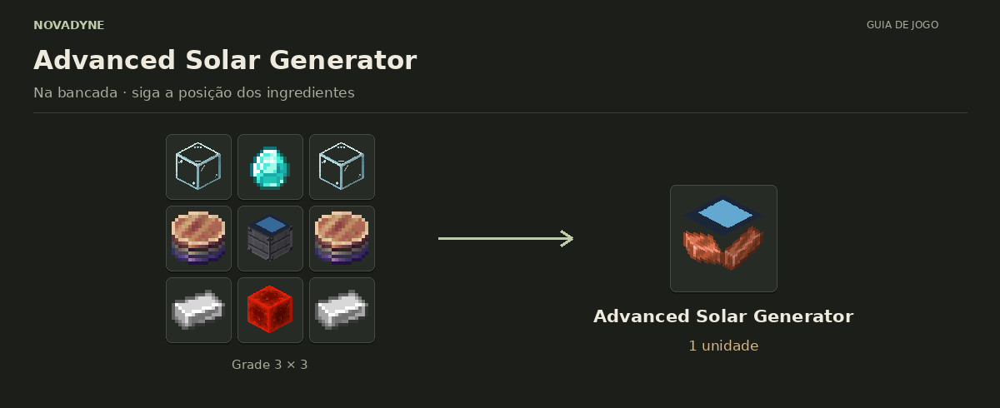

[Início](../README.md) · [Receitas](../receitas.md) · [Máquinas](../maquinas.md) · [Materiais](../materiais.md) · [Valves](../valves.md) · [Progressão](../progressao.md) · [Como testar](../testar.md)

---

# Advanced Solar Generator


`novadyne:advanced_solar_generator`

**Gerador solar avançado.** Céu aberto: 100 FE/t durante o dia e 25 FE/t à noite. Buffer de 40.000 FE.

## Como obter

### Advanced Solar Generator



| Quantidade | Ingrediente |
| ---: | --- |
| 2 | Vidro |
| 1 | Diamante |
| 2 | [Stacked Electronic Circuit](../itens/stacked_electronic_circuit.md) |
| 1 | [Basic Solar Generator](../itens/basic_solar_generator.md) |
| 2 | Barra de ferro |
| 1 | Bloco de redstone |

**Resultado:** 1 × [Advanced Solar Generator](../itens/advanced_solar_generator.md).

<details>
<summary>Ver no código</summary>

[Receita JSON](../../src/main/resources/data/novadyne/recipe/advanced_solar_generator.json)

</details>

## Onde usar

Por enquanto, não entra em nenhuma outra receita.

<details>
<summary>Pegar este item em criativo</summary>

```mcfunction
/give @s novadyne:advanced_solar_generator
```

</details>
