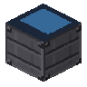
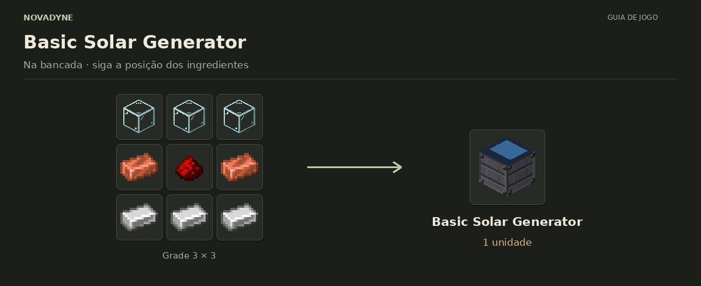

[Início](../README.md) · [Receitas](../receitas.md) · [Máquinas](../maquinas.md) · [Materiais](../materiais.md) · [Valves](../valves.md) · [Progressão](../progressao.md) · [Como testar](../testar.md)

---

# Basic Solar Generator



`novadyne:basic_solar_generator`

**Gerador solar básico.** Céu aberto: 40 FE/t durante o dia e 0 FE/t à noite. Buffer de 40.000 FE.

## Como obter

### Basic Solar Generator



| Quantidade | Ingrediente |
| ---: | --- |
| 3 | Vidro |
| 2 | Barra de cobre |
| 1 | Redstone |
| 3 | Barra de ferro |

**Resultado:** 1 × [Basic Solar Generator](../itens/basic_solar_generator.md).

<details>
<summary>Ver no código</summary>

[Receita JSON](../../src/main/resources/data/novadyne/recipe/basic_solar_generator.json)

</details>

## Onde usar

- Craft de [Advanced Solar Generator](../itens/advanced_solar_generator.md).

<details>
<summary>Pegar este item em criativo</summary>

```mcfunction
/give @s novadyne:basic_solar_generator
```

</details>
