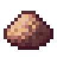
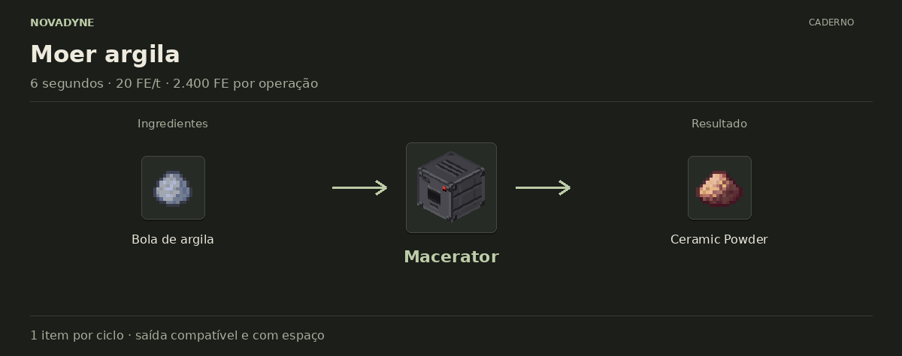

[Início](../README.md) · [Receitas](../receitas.md) · [Máquinas](../maquinas.md) · [Materiais](../materiais.md) · [Valves](../valves.md) · [Progressão](../progressao.md) · [Como testar](../testar.md)

---

# Ceramic Powder



`novadyne:ceramic_powder`

O primeiro material da linha: basta moer argila no Macerator. Guarde um pouco para construir a Wafer Press.

## Como obter

### Moer argila



| Quantidade | Ingrediente |
| ---: | --- |
| 1 | Bola de argila |

**Resultado:** 1 × [Ceramic Powder](../itens/ceramic_powder.md).

Consome 1 bola de argila. Deixe espaço para Ceramic Powder na saída.

<details>
<summary>Ver no código</summary>

[Lógica da máquina](../../src/main/java/com/novadyne/common/blockentity/MaceratorBlockEntity.java)

</details>

## Onde usar

- Craft de [Wafer Press](../itens/wafer_press.md).
- Prensar cerâmica, em [Wafer Press](../itens/wafer_press.md).

<details>
<summary>Pegar este item em criativo</summary>

```mcfunction
/give @s novadyne:ceramic_powder
```

</details>
