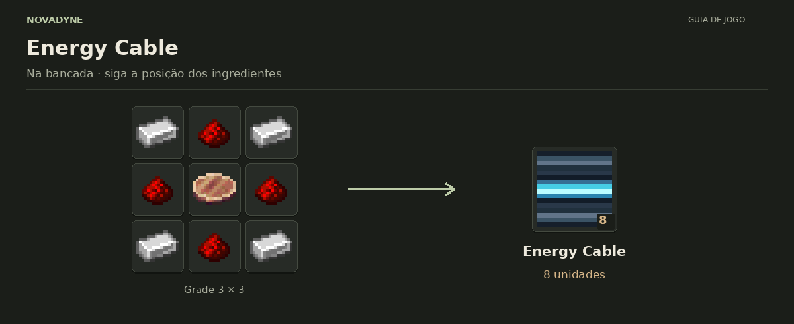

[Início](../README.md) · [Receitas](../receitas.md) · [Máquinas](../maquinas.md) · [Materiais](../materiais.md) · [Valves](../valves.md) · [Progressão](../progressao.md) · [Como testar](../testar.md)

---

# Energy Cable


`novadyne:energy_cable`

**Cabo de energia.** Fuel Generator ou gerador solar → Energy Cable → Macerator ou outra máquina com capability de energia. Os braços apontam apenas para outros cabos e blocos com capability de energia. Cada gerador percorre até 128 cabos carregados e transfere até sua taxa de geração por tick. Blocos externos também podem inserir FE pela capability do cabo. Cada transferência respeita a transação de origem.

## Como obter

### Energy Cable



| Quantidade | Ingrediente |
| ---: | --- |
| 4 | Barra de ferro |
| 4 | Redstone |
| 1 | [Copper Layer](../itens/part_copper_layer.md) |

**Resultado:** 8 × [Energy Cable](../itens/energy_cable.md).

<details>
<summary>Ver no código</summary>

[Receita JSON](../../src/main/resources/data/novadyne/recipe/energy_cable.json)

</details>

## Onde usar

Por enquanto, não entra em nenhuma outra receita.

<details>
<summary>Pegar este item em criativo</summary>

```mcfunction
/give @s novadyne:energy_cable
```

</details>
