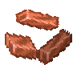
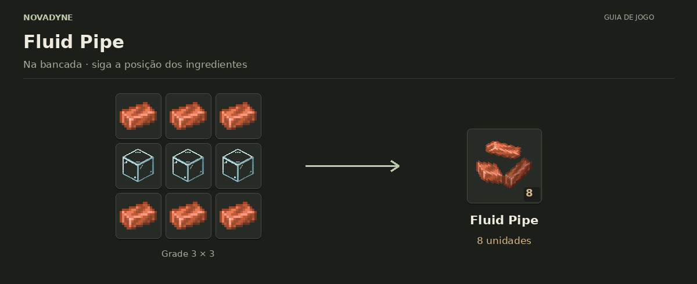

[Início](../README.md) · [Receitas](../receitas.md) · [Máquinas](../maquinas.md) · [Materiais](../materiais.md) · [Valves](../valves.md) · [Progressão](../progressao.md) · [Como testar](../testar.md)

---

# Fluid Pipe



`novadyne:fluid_pipe`

**Cabo de água.** Conecta o Water Sink à entrada de fluidos da Lithography. Liga em todas as seis direções; não transporta energia.

## Como obter

### Fluid Pipe



| Quantidade | Ingrediente |
| ---: | --- |
| 6 | Barra de cobre |
| 3 | Vidro |

**Resultado:** 8 × [Fluid Pipe](../itens/fluid_pipe.md).

<details>
<summary>Ver no código</summary>

[Receita JSON](../../src/main/resources/data/novadyne/recipe/fluid_pipe.json)

</details>

## Onde usar

- Limpar wafer com água encanada, em [Lithography](../itens/litografia.md).

<details>
<summary>Pegar este item em criativo</summary>

```mcfunction
/give @s novadyne:fluid_pipe
```

</details>
