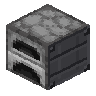
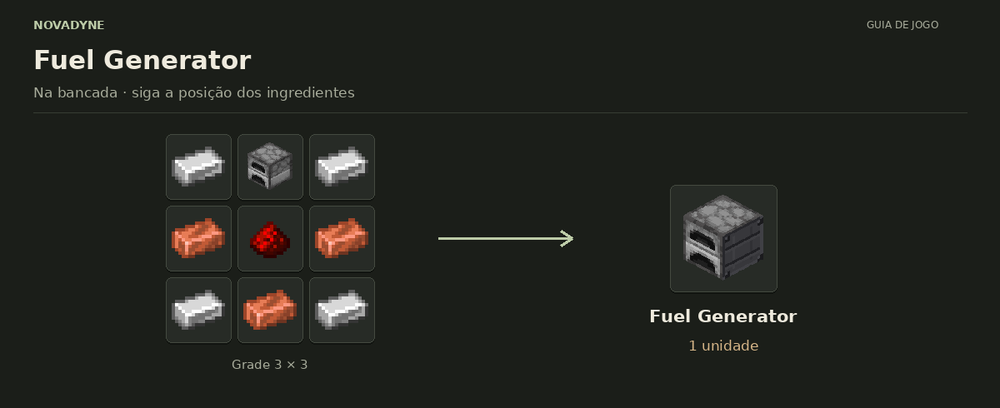

[Início](../README.md) · [Receitas](../receitas.md) · [Máquinas](../maquinas.md) · [Materiais](../materiais.md) · [Valves](../valves.md) · [Progressão](../progressao.md) · [Como testar](../testar.md)

---

# Fuel Generator



`novadyne:fuel_generator`

**Gerador a combustível.** Aceita madeira, carvão, balde de lava e outros combustíveis válidos da fornalha. Gera 80 FE/t enquanto queima; pausa ao encher o buffer de 40.000 FE. Recipientes vazios vão para o slot de saída.

## Como obter

### Fuel Generator



| Quantidade | Ingrediente |
| ---: | --- |
| 4 | Barra de ferro |
| 1 | Fornalha |
| 3 | Barra de cobre |
| 1 | Redstone |

**Resultado:** 1 × [Fuel Generator](../itens/fuel_generator.md).

<details>
<summary>Ver no código</summary>

[Receita JSON](../../src/main/resources/data/novadyne/recipe/fuel_generator.json)

</details>

## Onde usar

Por enquanto, não entra em nenhuma outra receita.

<details>
<summary>Pegar este item em criativo</summary>

```mcfunction
/give @s novadyne:fuel_generator
```

</details>
