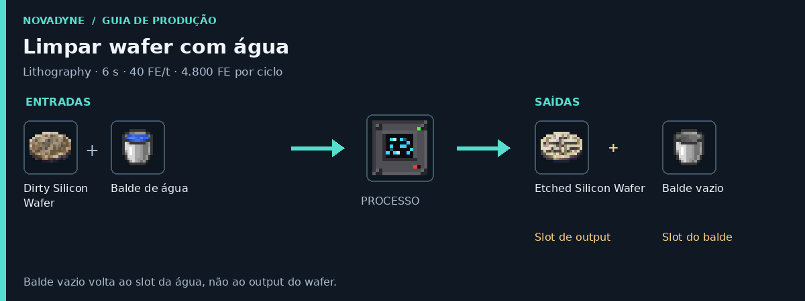

[Início](../README.md) · [Receitas](../receitas.md) · [Máquinas](../maquinas.md) · [Materiais](../materiais.md) · [Valves](../valves.md) · [Progressão](../progressao.md) · [Como testar](../testar.md)

---

# Lithography


`novadyne:litografia`

## Operação

| Propriedade | Valor |
| --- | --- |
| Capacidade | 20.000 FE |
| Consumo | 40 FE/t |
| Duração | 120 ticks / 6 s |
| Energia por ciclo | 4.800 FE |

Tempos consideram 20 ticks por segundo. A extração externa de energia é bloqueada. Sem energia suficiente para o próximo tick, o progresso é zerado.

**Slots:** entrada, balde, valve e saída. A valve afeta apenas a chance da gravação. Na limpeza, o balde vazio permanece no slot do balde.

## Como obter

### Lithography — litografia


| Quantidade | Ingrediente |
| ---: | --- |
| 2 | Vidro |
| 1 | [Stacked Electronic Circuit](../itens/stacked_electronic_circuit.md) |
| 2 | [Pure Silicon](../itens/pure_silicon.md) |
| 1 | Balde de água |
| 2 | Barra de ferro |
| 1 | [Processor](../itens/processor.md) |

**Resultado:** 1 × [Lithography](../itens/litografia.md).

O balde de água tem o balde vazio como restante de crafting vanilla.

[Ver JSON da receita](../../src/main/resources/data/novadyne/recipe/litografia.json)

## Onde usar

Sem consumo em outra receita implementada no momento.

## Processos

### Gravar circuito


| Quantidade | Ingrediente |
| ---: | --- |
| 1 | [Stacked Electronic Circuit](../itens/stacked_electronic_circuit.md) |

**Resultado sorteado (um por ciclo):** 1 × [Dirty Silicon Wafer](../itens/part_electronic_dirty_silicon_wafer.md) **ou** 1 × [Failed Silicon Wafer](../itens/part_electronic_failed_silicon_wafer.md).

A chance depende da Valve Tier (consulte o guia Valves na navegação). Sem valve equivale ao tier 1: 70% de sucesso. Tier 7: 95%. A saída precisa estar vazia. Não consome água neste estágio.

[Ver lógica da máquina](../../src/main/java/com/novadyne/common/blockentity/LitografiaBlockEntity.java)

### Limpar wafer com água



| Quantidade | Ingrediente |
| ---: | --- |
| 1 | [Dirty Silicon Wafer](../itens/part_electronic_dirty_silicon_wafer.md) |
| 1 | Balde de água |

**Resultado:** 1 × [Etched Silicon Wafer](../itens/part_electronic_etched_silicon_wafer.md) + 1 × Balde vazio.

O wafer gravado vai para o output. **O balde vazio volta ao slot do balde**. Retire-o para inserir outro balde de água. Processo sem RNG.

[Ver lógica da máquina](../../src/main/java/com/novadyne/common/blockentity/LitografiaBlockEntity.java)


## Teste em criativo

```mcfunction
/give @s novadyne:litografia
```
