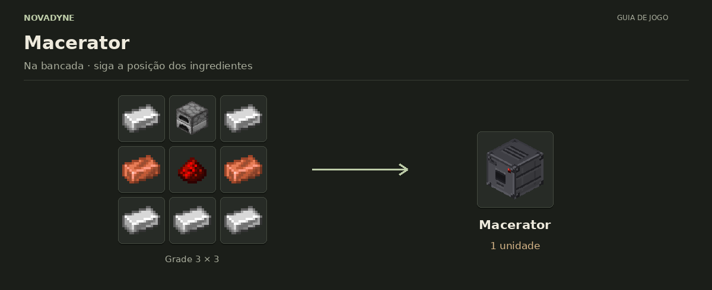
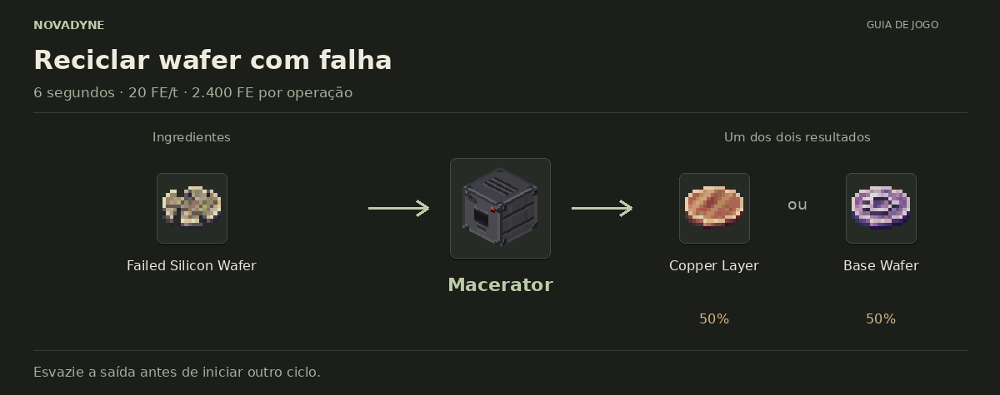

[Início](../README.md) · [Receitas](../receitas.md) · [Máquinas](../maquinas.md) · [Materiais](../materiais.md) · [Valves](../valves.md) · [Progressão](../progressao.md) · [Como testar](../testar.md)

---

# Macerator


`novadyne:macerator`

## Operação

| Propriedade | Valor |
| --- | --- |
| Capacidade | 10.000 FE |
| Consumo | 20 FE/t |
| Duração | 120 ticks / 6 s |
| Energia por ciclo | 2.400 FE |

Tempos consideram 20 ticks por segundo. Recebe energia, mas não fornece energia a outros blocos. Se faltar energia durante o trabalho, o progresso volta a zero.

**Slots:** entrada, saída e valve. A valve ainda não aplica bônus nesta máquina. A reciclagem exige output vazio.

## Como obter

### Macerator



| Quantidade | Ingrediente |
| ---: | --- |
| 5 | Barra de ferro |
| 1 | Fornalha |
| 2 | Barra de cobre |
| 1 | Redstone |

**Resultado:** 1 × [Macerator](../itens/macerator.md).

<details>
<summary>Ver no código</summary>

[Receita JSON](../../src/main/resources/data/novadyne/recipe/macerator.json)

</details>

## Onde usar

- Craft de [Wafer Press](../itens/wafer_press.md).

## O que dá para fazer

### Moer argila


| Quantidade | Ingrediente |
| ---: | --- |
| 1 | Bola de argila |

**Resultado:** 1 × [Ceramic Powder](../itens/ceramic_powder.md).

Consome 1 bola de argila. Deixe espaço para Ceramic Powder na saída.

<details>
<summary>Ver no código</summary>

[Lógica da máquina](../../src/main/java/com/novadyne/common/blockentity/MaceratorBlockEntity.java)

</details>

### Reciclar wafer com falha



| Quantidade | Ingrediente |
| ---: | --- |
| 1 | [Failed Silicon Wafer](../itens/part_electronic_failed_silicon_wafer.md) |

**Resultados possíveis:** 1 × [Copper Layer](../itens/part_copper_layer.md) **ou** 1 × [Base Wafer](../itens/part_base_wafer.md).

**50% para cada resultado**, um item por ciclo. Retire o que estiver na saída antes de começar.

<details>
<summary>Ver no código</summary>

[Lógica da máquina](../../src/main/java/com/novadyne/common/blockentity/MaceratorBlockEntity.java)

</details>


<details>
<summary>Pegar este item em criativo</summary>

```mcfunction
/give @s novadyne:macerator
```

</details>
