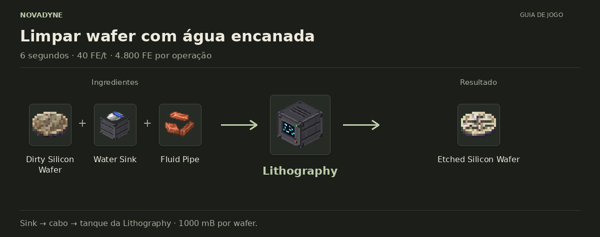

[Início](../README.md) · [Receitas](../receitas.md) · [Máquinas](../maquinas.md) · [Materiais](../materiais.md) · [Valves](../valves.md) · [Progressão](../progressao.md) · [Como testar](../testar.md)

---

# Etched Silicon Wafer


`novadyne:part_electronic_etched_silicon_wafer`

Wafer pronto e limpo. Por enquanto, a linha de produção termina aqui.

## Como obter

### Limpar wafer com água


| Quantidade | Ingrediente |
| ---: | --- |
| 1 | [Dirty Silicon Wafer](../itens/part_electronic_dirty_silicon_wafer.md) |
| 1 | Balde de água |

**Resultado:** 1 × [Etched Silicon Wafer](../itens/part_electronic_etched_silicon_wafer.md) + 1 × Balde vazio.

O wafer limpo vai para o output. O balde vazio retorna ao slot de água. Se o reservatório tiver ao menos 1000 mB, a máquina usa primeiro a água encanada e preserva o balde.

<details>
<summary>Ver no código</summary>

[Lógica da máquina](../../src/main/java/com/novadyne/common/blockentity/LitografiaBlockEntity.java)

</details>

### Limpar wafer com água encanada



| Quantidade | Ingrediente |
| ---: | --- |
| 1 | [Dirty Silicon Wafer](../itens/part_electronic_dirty_silicon_wafer.md) |
| 1 | [Water Sink](../itens/water_sink.md) |
| 1 | [Fluid Pipe](../itens/fluid_pipe.md) |

**Resultado:** 1 × [Etched Silicon Wafer](../itens/part_electronic_etched_silicon_wafer.md).

Instale o Water Sink e conecte uma linha de cabos de fluido à Lithography. Eles são infraestrutura e não são consumidos. O reservatório guarda até 4000 mB; cada wafer usa 1000 mB. A máquina ainda precisa de energia FE e espaço no output.

<details>
<summary>Ver no código</summary>

[Lógica da máquina](../../src/main/java/com/novadyne/common/blockentity/LitografiaBlockEntity.java)

</details>

## Onde usar

Por enquanto, não entra em nenhuma outra receita.

<details>
<summary>Pegar este item em criativo</summary>

```mcfunction
/give @s novadyne:part_electronic_etched_silicon_wafer
```

</details>
