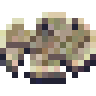
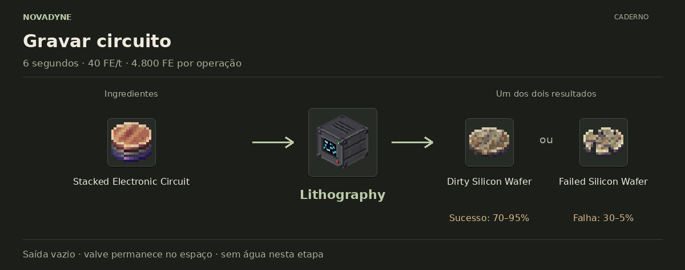

[Início](../README.md) · [Receitas](../receitas.md) · [Máquinas](../maquinas.md) · [Materiais](../materiais.md) · [Valves](../valves.md) · [Progressão](../progressao.md) · [Como testar](../testar.md)

---

# Failed Silicon Wafer



`novadyne:part_electronic_failed_silicon_wafer`

A gravação falhou, mas o material não está perdido: leve ao Macerator para recuperar cobre ou uma base.

## Como obter

### Gravar circuito



| Quantidade | Ingrediente |
| ---: | --- |
| 1 | [Stacked Electronic Circuit](../itens/stacked_electronic_circuit.md) |

**Você recebe um dos dois:** 1 × [Dirty Silicon Wafer](../itens/part_electronic_dirty_silicon_wafer.md) **ou** 1 × [Failed Silicon Wafer](../itens/part_electronic_failed_silicon_wafer.md).

A chance depende da Valve Tier (consulte o guia Valves na navegação). Sem valve equivale ao tier 1: 70% de sucesso. Tier 7: 95%. A saída precisa estar vazia. Não consome água neste estágio.

<details>
<summary>Ver no código</summary>

[Lógica da máquina](../../src/main/java/com/novadyne/common/blockentity/LitografiaBlockEntity.java)

</details>

## Onde usar

- Reciclar wafer com falha, em [Macerator](../itens/macerator.md).

<details>
<summary>Pegar este item em criativo</summary>

```mcfunction
/give @s novadyne:part_electronic_failed_silicon_wafer
```

</details>
