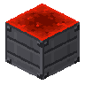

[Início](../README.md) · [Receitas](../receitas.md) · [Máquinas](../maquinas.md) · [Materiais](../materiais.md) · [Valves](../valves.md) · [Progressão](../progressao.md) · [Como testar](../testar.md)

---

# Test Power Hub



`novadyne:test_power_hub`

**Bloco de teste em criativo.** Fornece até 1.000 FE por tick para cada máquina NovaDyne dentro de um quadrado 5 × 5, no mesmo nível do bloco. É uma fonte infinita para testar as GUIs e os processos; não possui receita de craft.

## Como obter

Disponível no inventário criativo ou com `/give @s novadyne:test_power_hub`.

## Onde usar

Coloque-o no centro das máquinas que deseja alimentar.

<details>
<summary>Pegar este item em criativo</summary>

```mcfunction
/give @s novadyne:test_power_hub
```

</details>
