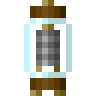
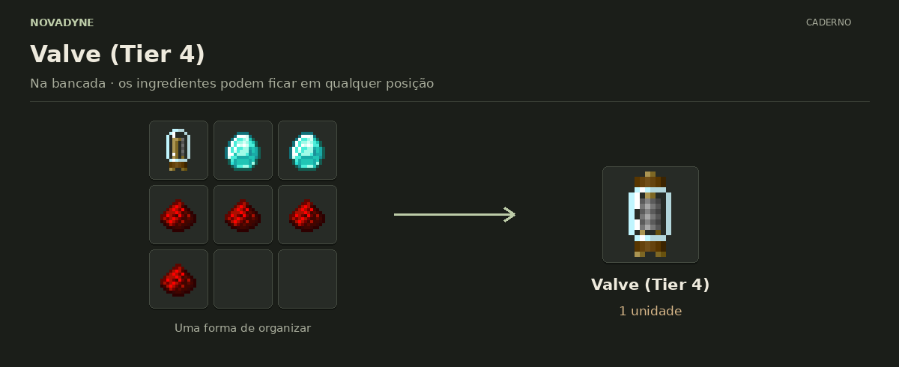

[Início](../README.md) · [Receitas](../receitas.md) · [Máquinas](../maquinas.md) · [Materiais](../materiais.md) · [Valves](../valves.md) · [Progressão](../progressao.md) · [Como testar](../testar.md)

---

# Valve (Tier 4)



`novadyne:valve_tier_4`

**Upgrade da Lithography.** Tier 4: 82.50% de sucesso e 17.50% de falha na gravação. A valve não é consumida.

## Como obter

### Valve (Tier 4)



| Quantidade | Ingrediente |
| ---: | --- |
| 1 | [Valve (Tier 3)](../itens/valve_tier_3.md) |
| 2 | Diamante |
| 4 | Redstone |

**Resultado:** 1 × [Valve (Tier 4)](../itens/valve_tier_4.md).

**Sem posição fixa:** basta colocar esses ingredientes na bancada, em qualquer ordem.

<details>
<summary>Ver no código</summary>

[Receita JSON](../../src/main/resources/data/novadyne/recipe/valve_tier_4.json)

</details>

## Onde usar

- Craft de [Valve (Tier 5)](../itens/valve_tier_5.md).
- Slot de valve da [Lithography](litografia.md); melhora a chance de sucesso.

<details>
<summary>Pegar este item em criativo</summary>

```mcfunction
/give @s novadyne:valve_tier_4
```

</details>
