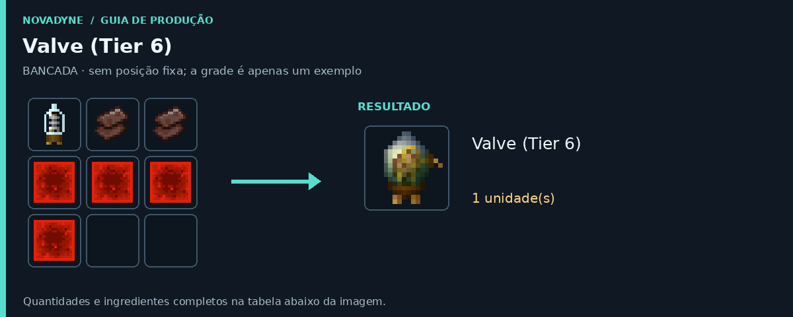

[Início](../README.md) · [Receitas](../receitas.md) · [Máquinas](../maquinas.md) · [Materiais](../materiais.md) · [Valves](../valves.md) · [Progressão](../progressao.md) · [Como testar](../testar.md)

---

# Valve (Tier 6)


`novadyne:valve_tier_6`

**Upgrade da Lithography.** Tier 6: 90.83% de sucesso e 9.17% de falha na gravação. A valve não é consumida.

## Como obter

### Valve (Tier 6) — valve_tier_6



| Quantidade | Ingrediente |
| ---: | --- |
| 1 | [Valve (Tier 5)](../itens/valve_tier_5.md) |
| 2 | Fragmento de netherita |
| 4 | Bloco de redstone |

**Resultado:** 1 × [Valve (Tier 6)](../itens/valve_tier_6.md).

**Sem posição fixa:** basta colocar esses ingredientes na bancada, em qualquer ordem.

[Ver JSON da receita](../../src/main/resources/data/novadyne/recipe/valve_tier_6.json)

## Onde usar

- Craft de [Valve (Tier 7)](../itens/valve_tier_7.md).
- Slot de valve da [Lithography](litografia.md); melhora a chance de sucesso.

## Teste em criativo

```mcfunction
/give @s novadyne:valve_tier_6
```
