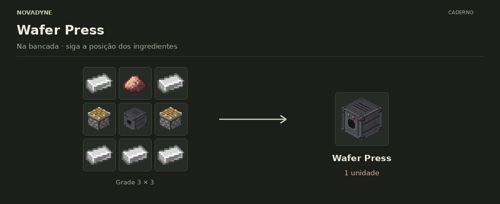
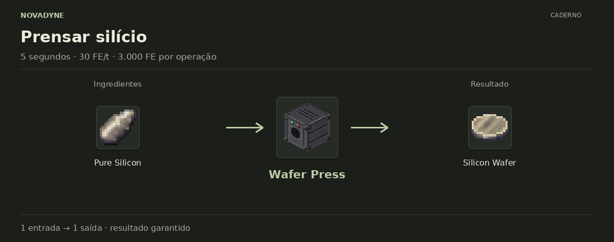
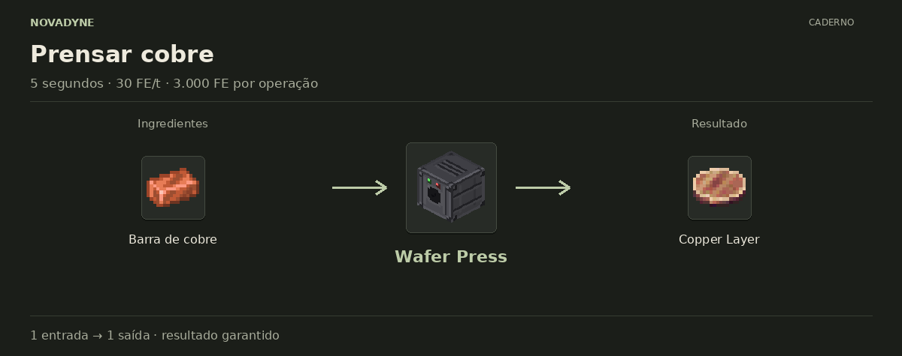
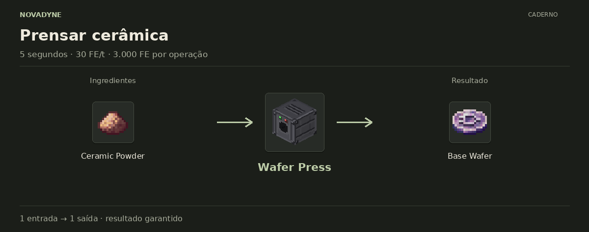

[Início](../README.md) · [Receitas](../receitas.md) · [Máquinas](../maquinas.md) · [Materiais](../materiais.md) · [Valves](../valves.md) · [Progressão](../progressao.md) · [Como testar](../testar.md)

---

# Wafer Press


`novadyne:wafer_press`

## Operação

| Propriedade | Valor |
| --- | --- |
| Capacidade | 15.000 FE |
| Consumo | 30 FE/t |
| Duração | 100 ticks / 5 s |
| Energia por ciclo | 3.000 FE |

Tempos consideram 20 ticks por segundo. Recebe energia, mas não fornece energia a outros blocos. Se faltar energia durante o trabalho, o progresso volta a zero.

**Slots:** entrada, saída e valve. A valve ainda não aplica bônus nesta máquina.

## Como obter

### Wafer Press



| Quantidade | Ingrediente |
| ---: | --- |
| 5 | Barra de ferro |
| 1 | [Ceramic Powder](../itens/ceramic_powder.md) |
| 2 | Pistão |
| 1 | [Macerator](../itens/macerator.md) |

**Resultado:** 1 × [Wafer Press](../itens/wafer_press.md).

<details>
<summary>Ver no código</summary>

[Receita JSON](../../src/main/resources/data/novadyne/recipe/wafer_press.json)

</details>

## Onde usar

- Craft de [Processor](../itens/processor.md).

## O que dá para fazer

### Prensar silício



| Quantidade | Ingrediente |
| ---: | --- |
| 1 | [Pure Silicon](../itens/pure_silicon.md) |

**Resultado:** 1 × [Silicon Wafer](../itens/part_silicon_wafer.md).

Conversão 1:1. A saída deve estar vazia ou conter o mesmo resultado com espaço.

<details>
<summary>Ver no código</summary>

[Lógica da máquina](../../src/main/java/com/novadyne/common/blockentity/WaferPressBlockEntity.java)

</details>

### Prensar cobre



| Quantidade | Ingrediente |
| ---: | --- |
| 1 | Barra de cobre |

**Resultado:** 1 × [Copper Layer](../itens/part_copper_layer.md).

Conversão 1:1. A saída deve estar vazia ou conter o mesmo resultado com espaço.

<details>
<summary>Ver no código</summary>

[Lógica da máquina](../../src/main/java/com/novadyne/common/blockentity/WaferPressBlockEntity.java)

</details>

### Prensar cerâmica



| Quantidade | Ingrediente |
| ---: | --- |
| 1 | [Ceramic Powder](../itens/ceramic_powder.md) |

**Resultado:** 1 × [Base Wafer](../itens/part_base_wafer.md).

Conversão 1:1. A saída deve estar vazia ou conter o mesmo resultado com espaço.

<details>
<summary>Ver no código</summary>

[Lógica da máquina](../../src/main/java/com/novadyne/common/blockentity/WaferPressBlockEntity.java)

</details>


<details>
<summary>Pegar este item em criativo</summary>

```mcfunction
/give @s novadyne:wafer_press
```

</details>
