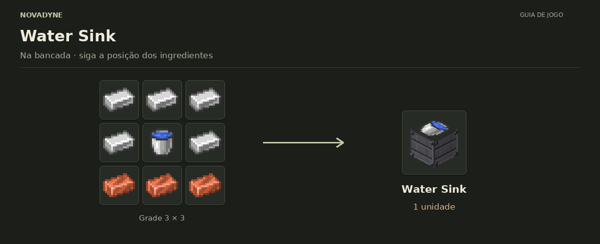

[Início](../README.md) · [Receitas](../receitas.md) · [Máquinas](../maquinas.md) · [Materiais](../materiais.md) · [Valves](../valves.md) · [Progressão](../progressao.md) · [Como testar](../testar.md)

---

# Water Sink


`novadyne:water_sink`

**Fonte infinita de água.** Fornece água aos blocos vizinhos e por uma rede de até 128 cabos de fluido em chunks carregados. Não consome energia.

## Como obter

### Water Sink



| Quantidade | Ingrediente |
| ---: | --- |
| 5 | Barra de ferro |
| 1 | Balde de água |
| 3 | Barra de cobre |

**Resultado:** 1 × [Water Sink](../itens/water_sink.md).

O balde vazio retorna após o craft.

<details>
<summary>Ver no código</summary>

[Receita JSON](../../src/main/resources/data/novadyne/recipe/water_sink.json)

</details>

## Onde usar

- Limpar wafer com água encanada, em [Lithography](../itens/litografia.md).

<details>
<summary>Pegar este item em criativo</summary>

```mcfunction
/give @s novadyne:water_sink
```

</details>
