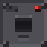
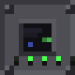

[Início](README.md) · [Receitas](receitas.md) · [Máquinas](maquinas.md) · [Materiais](materiais.md) · [Valves](valves.md) · [Progressão](progressao.md) · [Como testar](testar.md)

---

# Máquinas

| Ícone | Item | ID |
| --- | --- | --- |
|  | [Macerator](itens/macerator.md) | `macerator` |
|  | [Wafer Press](itens/wafer_press.md) | `wafer_press` |
|  | [Processor](itens/processor.md) | `processor` |
|  | [Lithography](itens/litografia.md) | `litografia` |

## Regras comuns

- Use energia externa FE ou, em testes com comandos, preencha o campo `energy`. Não há geração própria.
- Picareta de pedra ou superior permite recuperar o bloco. Ao quebrar, o inventário é derrubado; energia e progresso não são preservados no item da máquina.
- Output incompatível/cheio bloqueia o processamento. Não há transporte automático de itens implementado.
- As valves têm efeito na Lithography. Os slots presentes nas outras máquinas ainda não aplicam bônus.
