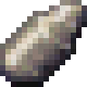
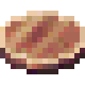

[Início](README.md) · [Receitas](receitas.md) · [Máquinas](maquinas.md) · [Materiais](materiais.md) · [Valves](valves.md) · [Progressão](progressao.md) · [Como testar](testar.md)

---

# Materiais

Clique no nome para ver obtenção, craft e usos.

| | Item |
| --- | --- |
|  | [Pure Silicon](itens/pure_silicon.md) |
|  | [Silicon Wafer](itens/part_silicon_wafer.md) |
|  | [Ceramic Powder](itens/ceramic_powder.md) |
|  | [Copper Layer](itens/part_copper_layer.md) |
|  | [Base Wafer](itens/part_base_wafer.md) |
|  | [Stacked Electronic Circuit](itens/stacked_electronic_circuit.md) |
|  | [Dirty Silicon Wafer](itens/part_electronic_dirty_silicon_wafer.md) |
|  | [Failed Silicon Wafer](itens/part_electronic_failed_silicon_wafer.md) |
|  | [Etched Silicon Wafer](itens/part_electronic_etched_silicon_wafer.md) |
