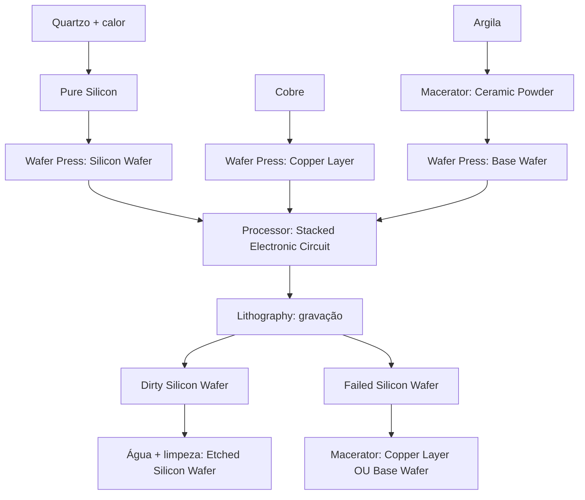

[Início](README.md) · [Receitas](receitas.md) · [Máquinas](maquinas.md) · [Materiais](materiais.md) · [Valves](valves.md) · [Progressão](progressao.md) · [Como testar](testar.md)

---

# Progressão industrial

1. **Prepare energia externa.** As máquinas consomem FE e este mod ainda não tem gerador. Para testes em criativo, use o comando do [guia de testes](testar.md).
2. **Faça o [Macerator](itens/macerator.md).** Processe argila para obter Ceramic Powder.
3. **Faça a [Wafer Press](itens/wafer_press.md).** O craft consome um Macerator; construa outro para manter as duas máquinas. A prensa transforma Ceramic Powder em Base Wafer, cobre em Copper Layer e Pure Silicon em Silicon Wafer.
4. **Faça o [Processor](itens/processor.md).** O craft consome uma Wafer Press. Construa outra para manter a produção dos componentes. Junte Silicon Wafer, Copper Layer e Base Wafer nos três slots, nessa ordem, para produzir Stacked Electronic Circuit.
5. **Faça a [Lithography](itens/litografia.md).** O craft consome um Processor e um circuito; conserve materiais para reconstruir a linha. Grave o circuito: sai Dirty Silicon Wafer ou Failed Silicon Wafer.
6. **Finalize ou recicle.** Limpe o wafer sujo com um balde de água ou com água do Water Sink transportada por cabos de fluido. Recicle o wafer com falha no Macerator: 50% Copper Layer, 50% Base Wafer.

Pure Silicon vem da fundição de quartzo. O wafer gravado é o final da cadeia implementada: ainda não tem aplicação posterior no mod.

## Fluxos de materiais

