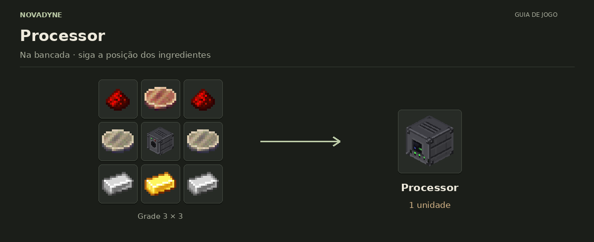
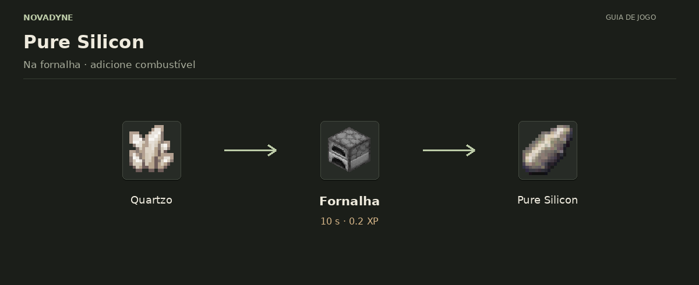
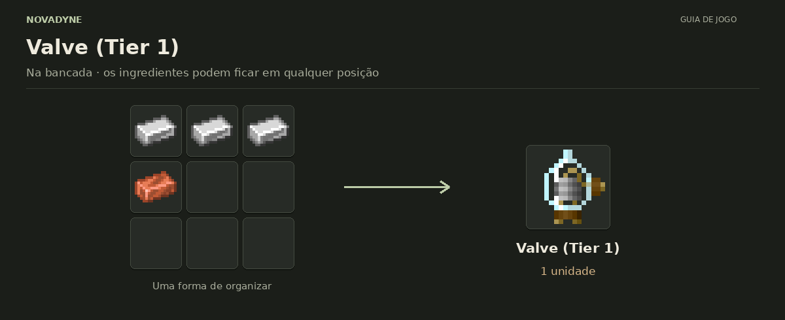
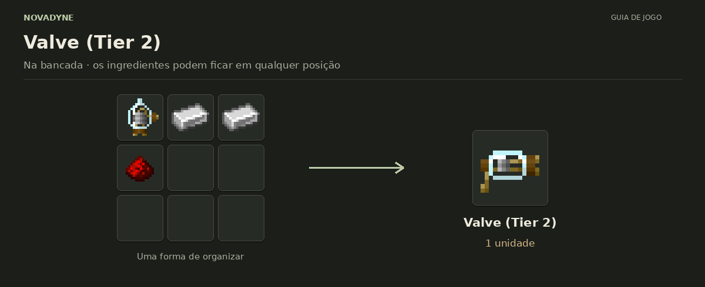
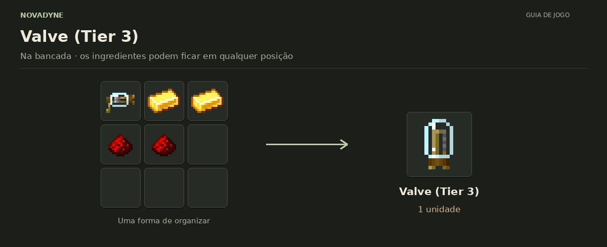
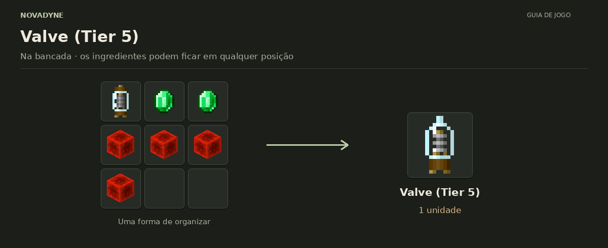

[Início](README.md) · [Receitas](receitas.md) · [Máquinas](maquinas.md) · [Materiais](materiais.md) · [Valves](valves.md) · [Progressão](progressao.md) · [Como testar](testar.md)

---

# Receitas e processos

As imagens mostram a disposição dos ingredientes e o resultado de cada operação. Na bancada, siga a grade quando houver posição fixa; nas máquinas, confira as entradas e deixe espaço na saída.

## Bancada e fornos

### Lithography

| Quantidade | Ingrediente |
| ---: | --- |
| 2 | Vidro |
| 1 | [Stacked Electronic Circuit](itens/stacked_electronic_circuit.md) |
| 2 | [Pure Silicon](itens/pure_silicon.md) |
| 1 | Balde de água |
| 2 | Barra de ferro |
| 1 | [Processor](itens/processor.md) |

**Resultado:** 1 × [Lithography](itens/litografia.md).

O balde vazio retorna após o craft.

Ver no código

[Receita JSON](../src/main/resources/data/novadyne/recipe/litografia.json)

### Macerator

| Quantidade | Ingrediente |
| ---: | --- |
| 5 | Barra de ferro |
| 1 | Fornalha |
| 2 | Barra de cobre |
| 1 | Redstone |

**Resultado:** 1 × [Macerator](itens/macerator.md).

Ver no código

[Receita JSON](../src/main/resources/data/novadyne/recipe/macerator.json)

### Processor

| Quantidade | Ingrediente |
| ---: | --- |
| 2 | Redstone |
| 1 | [Copper Layer](itens/part_copper_layer.md) |
| 2 | [Silicon Wafer](itens/part_silicon_wafer.md) |
| 1 | [Wafer Press](itens/wafer_press.md) |
| 2 | Barra de ferro |
| 1 | Barra de ouro |

**Resultado:** 1 × [Processor](itens/processor.md).

Ver no código

[Receita JSON](../src/main/resources/data/novadyne/recipe/processor.json)

### Pure Silicon · fornalha

| Quantidade | Ingrediente |
| ---: | --- |
| 1 | Quartzo |

**Resultado:** 1 × [Pure Silicon](itens/pure_silicon.md).

A tag `c:gems/quartz` contém quartzo vanilla neste mod e pode receber outros itens por datapacks. O combustível não está incluído no ingrediente.

Ver no código

[Receita JSON](../src/main/resources/data/novadyne/recipe/pure_silicon_from_quartz.json)

### Pure Silicon · alto-forno

| Quantidade | Ingrediente |
| ---: | --- |
| 1 | Quartzo |

**Resultado:** 1 × [Pure Silicon](itens/pure_silicon.md).

A tag `c:gems/quartz` contém quartzo vanilla neste mod e pode receber outros itens por datapacks. O combustível não está incluído no ingrediente.

Ver no código

[Receita JSON](../src/main/resources/data/novadyne/recipe/pure_silicon_from_quartz_blasting.json)

### Valve (Tier 1)

| Quantidade | Ingrediente |
| ---: | --- |
| 3 | Barra de ferro |
| 1 | Barra de cobre |

**Resultado:** 1 × [Valve (Tier 1)](itens/valve_tier_1.md).

**Sem posição fixa:** basta colocar esses ingredientes na bancada, em qualquer ordem.

Ver no código

[Receita JSON](../src/main/resources/data/novadyne/recipe/valve_tier_1.json)

### Valve (Tier 2)

| Quantidade | Ingrediente |
| ---: | --- |
| 1 | [Valve (Tier 1)](itens/valve_tier_1.md) |
| 2 | Barra de ferro |
| 1 | Redstone |

**Resultado:** 1 × [Valve (Tier 2)](itens/valve_tier_2.md).

**Sem posição fixa:** basta colocar esses ingredientes na bancada, em qualquer ordem.

Ver no código

[Receita JSON](../src/main/resources/data/novadyne/recipe/valve_tier_2.json)

### Valve (Tier 3)

| Quantidade | Ingrediente |
| ---: | --- |
| 1 | [Valve (Tier 2)](itens/valve_tier_2.md) |
| 2 | Barra de ouro |
| 2 | Redstone |

**Resultado:** 1 × [Valve (Tier 3)](itens/valve_tier_3.md).

**Sem posição fixa:** basta colocar esses ingredientes na bancada, em qualquer ordem.

Ver no código

[Receita JSON](../src/main/resources/data/novadyne/recipe/valve_tier_3.json)

### Valve (Tier 4)

| Quantidade | Ingrediente |
| ---: | --- |
| 1 | [Valve (Tier 3)](itens/valve_tier_3.md) |
| 2 | Diamante |
| 4 | Redstone |

**Resultado:** 1 × [Valve (Tier 4)](itens/valve_tier_4.md).

**Sem posição fixa:** basta colocar esses ingredientes na bancada, em qualquer ordem.

Ver no código

[Receita JSON](../src/main/resources/data/novadyne/recipe/valve_tier_4.json)

### Valve (Tier 5)

| Quantidade | Ingrediente |
| ---: | --- |
| 1 | [Valve (Tier 4)](itens/valve_tier_4.md) |
| 2 | Esmeralda |
| 4 | Bloco de redstone |

**Resultado:** 1 × [Valve (Tier 5)](itens/valve_tier_5.md).

**Sem posição fixa:** basta colocar esses ingredientes na bancada, em qualquer ordem.

Ver no código

[Receita JSON](../src/main/resources/data/novadyne/recipe/valve_tier_5.json)

### Valve (Tier 6)

| Quantidade | Ingrediente |
| ---: | --- |
| 1 | [Valve (Tier 5)](itens/valve_tier_5.md) |
| 2 | Fragmento de netherita |
| 4 | Bloco de redstone |

**Resultado:** 1 × [Valve (Tier 6)](itens/valve_tier_6.md).

**Sem posição fixa:** basta colocar esses ingredientes na bancada, em qualquer ordem.

Ver no código

[Receita JSON](../src/main/resources/data/novadyne/recipe/valve_tier_6.json)

### Valve (Tier 7)

| Quantidade | Ingrediente |
| ---: | --- |
| 1 | [Valve (Tier 6)](itens/valve_tier_6.md) |
| 2 | Barra de netherita |
| 6 | Bloco de redstone |

**Resultado:** 1 × [Valve (Tier 7)](itens/valve_tier_7.md).

**Sem posição fixa:** basta colocar esses ingredientes na bancada, em qualquer ordem.

Ver no código

[Receita JSON](../src/main/resources/data/novadyne/recipe/valve_tier_7.json)

### Wafer Press

| Quantidade | Ingrediente |
| ---: | --- |
| 5 | Barra de ferro |
| 1 | [Ceramic Powder](itens/ceramic_powder.md) |
| 2 | Pistão |
| 1 | [Macerator](itens/macerator.md) |

**Resultado:** 1 × [Wafer Press](itens/wafer_press.md).

Ver no código

[Receita JSON](../src/main/resources/data/novadyne/recipe/wafer_press.json)

## Nas máquinas

### Moer argila

| Quantidade | Ingrediente |
| ---: | --- |
| 1 | Bola de argila |

**Resultado:** 1 × [Ceramic Powder](itens/ceramic_powder.md).

Consome 1 bola de argila. Deixe espaço para Ceramic Powder na saída.

Ver no código

[Lógica da máquina](../src/main/java/com/novadyne/common/blockentity/MaceratorBlockEntity.java)

### Reciclar wafer com falha

| Quantidade | Ingrediente |
| ---: | --- |
| 1 | [Failed Silicon Wafer](itens/part_electronic_failed_silicon_wafer.md) |

**Resultados possíveis:** 1 × [Copper Layer](itens/part_copper_layer.md) **ou** 1 × [Base Wafer](itens/part_base_wafer.md).

**50% para cada resultado**, um item por ciclo. Retire o que estiver na saída antes de começar.

Ver no código

[Lógica da máquina](../src/main/java/com/novadyne/common/blockentity/MaceratorBlockEntity.java)

### Prensar silício

| Quantidade | Ingrediente |
| ---: | --- |
| 1 | [Pure Silicon](itens/pure_silicon.md) |

**Resultado:** 1 × [Silicon Wafer](itens/part_silicon_wafer.md).

Conversão 1:1. A saída deve estar vazia ou conter o mesmo resultado com espaço.

Ver no código

[Lógica da máquina](../src/main/java/com/novadyne/common/blockentity/WaferPressBlockEntity.java)

### Prensar cobre

| Quantidade | Ingrediente |
| ---: | --- |
| 1 | Barra de cobre |

**Resultado:** 1 × [Copper Layer](itens/part_copper_layer.md).

Conversão 1:1. A saída deve estar vazia ou conter o mesmo resultado com espaço.

Ver no código

[Lógica da máquina](../src/main/java/com/novadyne/common/blockentity/WaferPressBlockEntity.java)

### Prensar cerâmica

| Quantidade | Ingrediente |
| ---: | --- |
| 1 | [Ceramic Powder](itens/ceramic_powder.md) |

**Resultado:** 1 × [Base Wafer](itens/part_base_wafer.md).

Conversão 1:1. A saída deve estar vazia ou conter o mesmo resultado com espaço.

Ver no código

[Lógica da máquina](../src/main/java/com/novadyne/common/blockentity/WaferPressBlockEntity.java)

### Montar circuito eletrônico

| Quantidade | Ingrediente |
| ---: | --- |
| 1 | [Silicon Wafer](itens/part_silicon_wafer.md) |
| 1 | [Copper Layer](itens/part_copper_layer.md) |
| 1 | [Base Wafer](itens/part_base_wafer.md) |

**Resultado:** 1 × [Stacked Electronic Circuit](itens/stacked_electronic_circuit.md).

Coloque **Silicon Wafer, Copper Layer e Base Wafer nos três slots de entrada, da esquerda para a direita**. Consome 1 de cada.

Ver no código

[Lógica da máquina](../src/main/java/com/novadyne/common/blockentity/ProcessorBlockEntity.java)

### Gravar circuito

| Quantidade | Ingrediente |
| ---: | --- |
| 1 | [Stacked Electronic Circuit](itens/stacked_electronic_circuit.md) |

**Resultados possíveis:** 1 × [Dirty Silicon Wafer](itens/part_electronic_dirty_silicon_wafer.md) **ou** 1 × [Failed Silicon Wafer](itens/part_electronic_failed_silicon_wafer.md).

A chance depende da Valve Tier (consulte o guia Valves na navegação). Sem valve equivale ao tier 1: 70% de sucesso. Tier 7: 95%. A saída precisa estar vazia. Não consome água neste estágio.

Ver no código

[Lógica da máquina](../src/main/java/com/novadyne/common/blockentity/LitografiaBlockEntity.java)

### Limpar wafer com água

| Quantidade | Ingrediente |
| ---: | --- |
| 1 | [Dirty Silicon Wafer](itens/part_electronic_dirty_silicon_wafer.md) |
| 1 | Balde de água |

**Resultado:** 1 × [Etched Silicon Wafer](itens/part_electronic_etched_silicon_wafer.md) + 1 × Balde vazio.

O wafer gravado vai para o output. **O balde vazio volta ao slot do balde**. Retire-o para inserir outro balde de água. A limpeza sempre dá o mesmo resultado.

Ver no código

[Lógica da máquina](../src/main/java/com/novadyne/common/blockentity/LitografiaBlockEntity.java)

